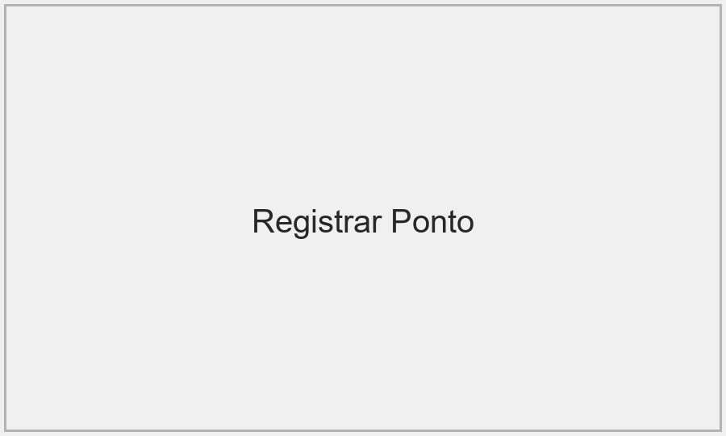

# Guia do Funcionário — Ponto ExSA

Este documento descreve, passo a passo, o que o usuário final pode fazer no sistema Ponto ExSA e como realizar cada ação.

## Menu (lista suspensa) - itens e uso

1. 🕐 Registrar Ponto
   - O que faz: Registra `Início`, `Intermediário` ou `Fim` de jornada.
   - Como usar:
     1. Abra "Registrar Ponto".
     2. Escolha a data (hoje ou até 3 dias retroativos).
     3. Selecionar modalidade (Presencial, Home Office, Trabalho em Campo).
     4. Selecionar tipo (Início, Intermediário, Fim).
     5. Escolher projeto e descrever a atividade.
   6. Confirmar "✅ Registrar Ponto".
     7. Confirmar "✅ Registrar Ponto".
   - Observações: se GPS estiver disponível, será preenchido automaticamente; o sistema valida duplicidade de "Início" e "Fim".

2. 📋 Meus Registros
   - O que faz: Exibe o espelho de ponto (histórico por período).
   - Como usar:
     1. Abrir "Meus Registros".
     2. Selecionar período (data início/fim).
     3. Visualizar detalhes por dia: primeiro/último registro, horas trabalhadas, descontos e observações.

3. 🔧 Solicitar Correção de Registro
   - O que faz: Permite solicitar que um gestor corrija ou crie um registro de ponto.
   - Como usar:
     1. Escolher correção ou criação.
     2. Informar registro alvo (se corrigir) ou nova data/hora (se criar).
     3. Preencher justificativa e escolher aprovador.
     4. Enviar e aguardar decisão do gestor.

4. 🏥 Registrar Ausência
   - O que faz: Registrar ausências (férias, faltas, licenças).
   - Como usar:
     1. Abrir "Registrar Ausência".
     2. Informar período, tipo e justificativa.
     3. Anexar comprovante (opcional).
     4. Enviar.

5. ⏰ Atestado de Horas
   - O que faz: Registrar atestados (comprovantes de horários/ausência).
   - Como usar:
     1. Abrir "Atestado de Horas".
     2. Informar data, hora início/fim, motivo.
     3. Anexar comprovante (pdf/jpg/png) ou marcar que não possui comprovante.
     4. Enviar e acompanhar status (pendente → aprovado/rejeitado).

6. 🕐 Horas Extras
   - O que faz: Solicitar, iniciar e encerrar horas extras; acompanhar histórico.
   - Como usar:
     1. No painel de HE, clicar "▶️ Solicitar Horas Extras" ou iniciar HE em popup quando expediente terminar.
     2. Preencher data/hora início, hora fim, justificativa e aprovador.
     3. Enviar. Para encerrar HE em andamento, clique "⏹️ Finalizar Horas Extras", informe justificativa e aprovador.
   - Regras: justificativa obrigatória; avisos sobre limites legais (máx 2h/dia, 10h/semana).

7. 🏦 Meu Banco de Horas
   - O que faz: Consultar saldo do banco de horas e extrato.
   - Como usar:
     1. Abrir "Meu Banco de Horas".
     2. Visualizar saldo e extrato por períodos.

8. 📊 Minhas Horas por Projeto
   - O que faz: Relatório das horas distribuídas por projeto.
   - Como usar: abrir a tela e filtrar por período/projeto.

9. 📁 Meus Arquivos
   - O que faz: Lista e gerencia uploads do usuário (atestados, documentos).
   - Como usar:
     1. Enviar arquivo (pdf, jpg, png, doc/docx, txt, rtf) — máximo 10MB.
     2. Baixar ou remover arquivos pessoais.

10. 💬 Mensagens
    - O que faz: Mensagens diretas enviadas pelo gestor.
    - Como usar: abrir "Mensagens", ler mensagens não lidas e marcá-las como lidas.

11. 🔔 Notificações
    - O que faz: Central de notificações e pendências (atestados, correções, horas extras).
    - Como usar: abrir "Notificações" e navegar entre as abas: "Horas Extras para Aprovar", "Minhas Correções", "Meus Atestados".

## Nota sobre Selfie

- O recurso de selfie não está disponível nesta versão do sistema. Ignore qualquer instrução sobre captura de selfie.

## Capturas de Tela (incluir imagens)

Para incluir capturas de tela na cartilha gerada em PDF, salve imagens PNG/JPG na pasta `assets/screenshots/` na raiz do repositório com os nomes abaixo. O gerador de PDF (`cartilha_funcionario.py`) procura por essas imagens e as embute no documento quando encontradas.

- `assets/screenshots/registrar_ponto.png` — tela de "Registrar Ponto" (formulário de batida).
- `assets/screenshots/meus_registros.png` — tela "Meus Registros" (espelho de ponto).
- `assets/screenshots/notificacoes.png` — tela "Notificações" (explicando ativação do Push).

Você pode usar qualquer formato comum (`.png`, `.jpg`) e nomes diferentes, mas então deve ajustar as referências nesse documento ou usar os mesmos nomes acima.

Exemplo de referência que o gerador reconhece (já aplicada automaticamente):



Se as imagens não existirem, a cartilha exibirá um aviso no lugar da captura indicando que o arquivo não foi encontrado.

## Push com ntfy (ativar no app e uso no celular)

1. Como o sistema envia push:
   - O sistema gera um tópico único para cada usuário (ex.: `ponto-exsa-1a2b3c4d`).
   - O backend envia mensagens para `https://ntfy.sh/<tópico>` usando o método POST.
   - Para receber push no celular, você precisa se inscrever nesse tópico no app `ntfy`.

2. Como ativar pelo app (Android):
   - Abra a Play Store e instale o app "ntfy".
   - Abra o app e clique em "+" ou "Add subscription".
   - Informe apenas o tópico fornecido (ex.: `ponto-exsa-1a2b3c4d`) ou a URL `https://ntfy.sh/ponto-exsa-1a2b3c4d`.
   - Confirme e permita notificações.
   - Após isso, todas as notificações enviadas pelo sistema para o seu tópico chegarão no celular.

3. Como ativar via interface do sistema:
   - Abra "Notificações" e na seção "Push (ntfy) - Ativar / Desativar" clique em "Ativar Push (ntfy)".
   - O sistema registra seu tópico e mostra o nome do tópico (ex.: `ponto-exsa-1a2b3c4d`).
   - Use esse tópico no app `ntfy` do seu celular.

4. Código de exemplo (será executado no backend):

```python
from push_scheduler import registrar_subscription, enviar_notificacao

# Registrar (executar no backend quando usuário pedir ativar)
topic = registrar_subscription(usuario='joao')
print('Tópico registrado:', topic)

# Enviar notificação (backend)
enviar_notificacao(usuario='joao', titulo='Lembrete de Ponto', mensagem='Não esqueça de bater o ponto', emoji='⏰')
```

## Como usar no celular (passo a passo resumido)

1. Instale o app `ntfy` (Android) ou qualquer app compatível com tópicos ntfy.
2. No app, adicione uma nova subscription e insira o tópico que o sistema mostrou.
3. Permita notificações e ajuste som/vibração no app se desejar.
4. Ao receber notificações, abra a app ou clique na notificação para ir ao sistema.

## Observações finais

- Sempre verifique o espelho de ponto após registrar para confirmar o registro.
- Em caso de problemas de upload de arquivos, verifique a conexão e tente novamente.
- Para dúvidas, contate RH ou o gestor responsável.


---

*Documento gerado automaticamente. Para gerar o PDF, execute o script `cartilha_funcionario.py`.*
