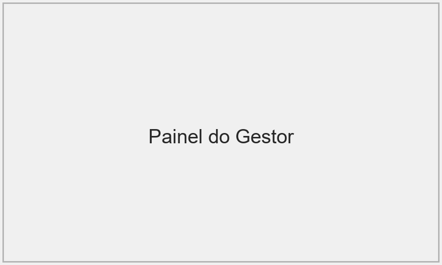

# Guia do Gestor — Ponto ExSA

Este documento descreve as ações disponíveis para perfis de gestor no sistema Ponto ExSA e como usá-las.

## Painel do Gestor

- O que faz: Visão geral com pendências, filtros por equipe e acesso rápido às aprovações.
- Como usar:
  1. Acesse "Painel do Gestor".
  2. Filtre por período, equipe ou colaborador.
  3. Clique em um item de pendência para abrir detalhes e ações.

## Aprovar/Rejeitar Correções de Registro

- O que faz: Analisa solicitações de correção ou criação de ponto enviadas por funcionários.
- Como usar:
  1. Abra "Correções / Ajustes".
  2. Selecione a solicitação.
  3. Reveja justificativa, evidências e histórico.
  4. Clique "Aprovar" ou "Rejeitar" e escreva comentário (opcional).

## Aprovar/Rejeitar Atestados

- O que faz: Gerencia atestados enviados pelos funcionários.
- Como usar:
  1. Abra "Atestados" na seção de aprovações.
  2. Visualize o documento anexo (pdf/jpg/png).
  3. Clique "Aprovar" ou "Rejeitar" e registre observação.

## Gerenciar Horas Extras

- O que faz: Aprovar ou negar solicitações de horas extras e encerrar HE em aberto.
- Como usar:
  1. Acesse "Horas Extras para Aprovar".
  2. Selecione solicitação; confirme horas e justificativa.
  3. Aprove ou rejeite.

## Banco de Horas e Relatórios

- O que faz: Consultar saldos e gerar relatórios por colaborador ou projeto.
- Como usar:
  1. Abra "Banco de Horas" ou "Relatórios".
  2. Escolha período e exporte em CSV/PDF.

## Mensagens e Comunicação

- O que faz: Enviar mensagens diretas para colaboradores ou publicar comunicados.
- Como usar:
  1. Abra "Mensagens".
  2. Selecione destinatários (indivíduo, equipe).
  3. Envie mensagem com prioridade ou anexo.

## Notificações e Push (ntfy)

- O que faz: Visualizar e gerenciar inscrições de push da equipe.
- Como usar:
  1. Em "Notificações", abra a área de Push (ntfy).
  2. Veja tópicos registrados pelos usuários e reenvie instruções de inscrição por e-mail.

## Capturas de Tela (incluir imagens)

Para incluir capturas de tela na cartilha do gestor, salve imagens PNG/JPG em `assets/screenshots/` com os nomes abaixo:

- `assets/screenshots/painel_gestor.png` — visão geral do painel do gestor.
- `assets/screenshots/aprovar_correcoes.png` — tela de aprovação de correções.
- `assets/screenshots/aprovar_atestados.png` — visualização de atestados e botões de ação.

Exemplo de referência reconhecida pelo gerador (marca automática):

Se as imagens não existirem, o PDF exibirá uma nota indicando que o arquivo não foi encontrado.

---

*Documento preparado para geração de cartilha. Para gerar o PDF, execute `cartilha_gestor.py`.*
